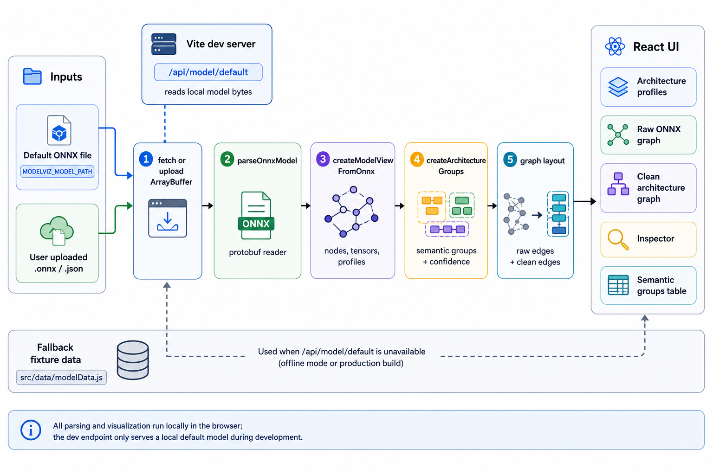

<div align="center">
  

  **🔎 Turn raw ONNX graphs into clean model views 🔎**
</div>

ModelViz is a local React app for inspecting ONNX model structure. It parses model bytes in the browser, groups raw operators into semantic architecture blocks, and shows the raw graph beside a cleaner model-level view.

Use it to open an ONNX file from disk or the web, compare raw nodes with inferred groups, and inspect tensors, metadata, traceability, confidence, and model-profile matches.

## Install

```bash
git clone git@github.com:tsilva/modelviz.git
cd modelviz
pnpm install
pnpm dev
```

Open the local Vite URL printed by the dev server, usually [http://127.0.0.1:5173](http://127.0.0.1:5173).

## Commands

```bash
pnpm dev      # start the local Vite dev server
pnpm build    # build the production bundle
pnpm preview  # preview the production bundle locally
```

## Notes

- ModelViz starts with an empty state and prompts you to open an ONNX file.
- Uploaded files are parsed in the browser with the local ONNX protobuf parser.
- The web model browser searches Hugging Face ONNX model files and estimates browser parsing fit from file size, device memory, and CPU thread count before loading.
- The dev server still exposes `/api/model/default` for local experiments.
- Set `MODELVIZ_MODEL_PATH=/path/to/model.onnx` to choose the file served by that endpoint.
- If `MODELVIZ_MODEL_PATH` is not set, the dev server looks for `~/Desktop/mnist_mlp_best_seed1.onnx`.
- The package is marked `private` and does not declare a license.

## Architecture



## License

No license file is currently included.
