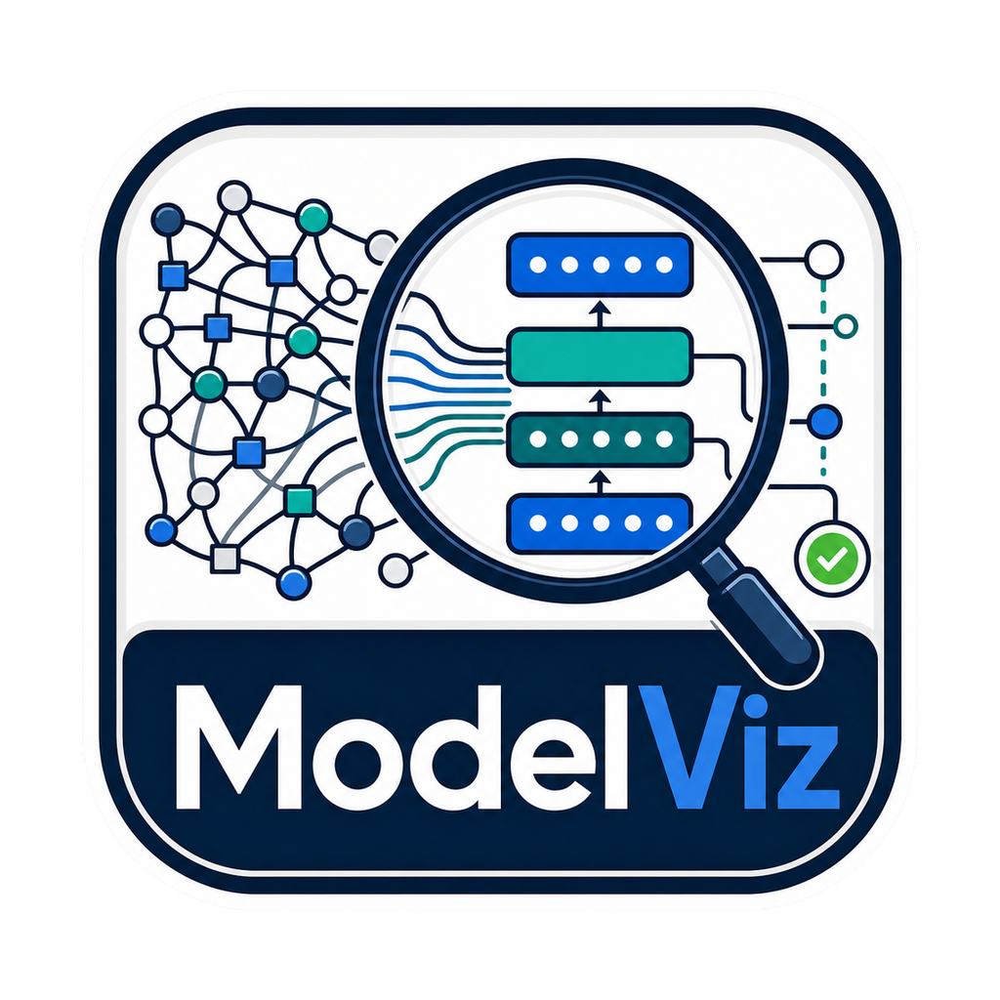
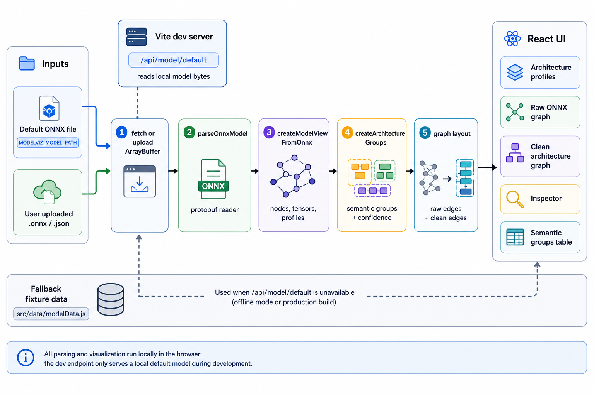

<p align="center">
  
  <br />
  <!-- repo-tagline:start -->
  <strong>🔎 Turn raw ONNX graphs into clean model views 🔎</strong>
  <!-- repo-tagline:end -->
</p>

ModelViz is a local React app for inspecting ONNX model structure. It parses model bytes in the browser, groups raw operators into semantic architecture blocks, and shows the raw graph beside a cleaner model-level view.

Use it to open an ONNX file from disk or the web, compare raw nodes with inferred groups, and inspect tensors, metadata, traceability, confidence, and model-profile matches.

## Install

```bash
git clone git@github.com:tsilva/modelviz.git
cd modelviz
pnpm install --frozen-lockfile
pnpm dev --port auto
```

Open the local Vite URL printed by the dev server, usually [http://127.0.0.1:5173](http://127.0.0.1:5173).

## Commands

```bash
pnpm dev      # start the local Vite dev server
pnpm audit --audit-level low  # audit the complete dependency graph
pnpm test     # run architecture mapping and dependency security regressions
pnpm build    # build the production bundle
pnpm preview  # preview the production bundle locally
```

## Notes

- ModelViz starts with an empty state and prompts you to open an ONNX file.
- Uploaded files are parsed in the browser with the local ONNX protobuf parser.
- The web model browser searches Hugging Face ONNX model files and estimates browser parsing fit from file size, device memory, and CPU thread count before loading.
- The dev server still exposes `/api/model/default` for local experiments.
- Set `MODELVIZ_MODEL_PATH=/path/to/model.onnx` to choose the file served by that endpoint.
- If `MODELVIZ_MODEL_PATH` is not set, the dev server looks for `~/Desktop/mnist_mlp_best_seed1.onnx`.
- The package is marked `private` and does not declare a license.

## Architecture mapping

The linked split view connects architecture groups to the actual ONNX operators
and tensors that implement them. Select a block to highlight and frame its source
operators, or select an operator to find its currently visible architecture group.
The dashed cross-pane link represents that selection, not a tensor connection.

- Expand recognized groups into primitives. The Architecture panel provides the
  same hierarchy and lets you collapse groups again.
- Use **Selected group only** to isolate its raw subgraph. Raw, Clean, and Split
  views all support panning, zoom, fit, and selection framing.
- The bottom inspector shows recognition evidence, contributing raw nodes,
  boundary tensors, parameters, recorded shapes, and selected operator attributes.
- Clean edges are derived from tensors crossing group boundaries. Unrecognized
  operators stay visible as exact primitives.

Recognition currently supports connected attention (`MatMul → Softmax → MatMul`
with projection/layout helpers), constant-weight dense and feed-forward patterns,
convolution with bias/normalization/activation, and rank-2 embedding lookups.
Exporter namespaces such as `h.0` and `layers.0` provide optional block hierarchy;
they are labeled as exporter scopes. Pattern matches are inferences, not calibrated
probabilities. Self versus cross attention is not inferred from the basic attention
pattern alone. Fused attention remains one operator; absent internals are not
invented. Control-flow subgraphs are retained in attributes but currently appear
as opaque parent operators in the top-level mapping. Missing intermediate shapes
are shown as unrecorded rather than estimated.

`pnpm test` runs mapping, parser, graph-layout, and dependency regressions. A small
authored ONNX fixture is available at `tests/fixtures/attention.onnx`; regenerate
it with `node tests/fixtures/attention-model.mjs`. It contains two attention blocks
with residual connections and is intended for UI and mapping tests, not inference
quality evaluation.

## Architecture



## License

No license file is currently included.

Production delivery runs on pushes to `main` and supports manual secret rotations. See [production delivery](docs/production-delivery.md) for destinations, access boundaries and failure behavior.
